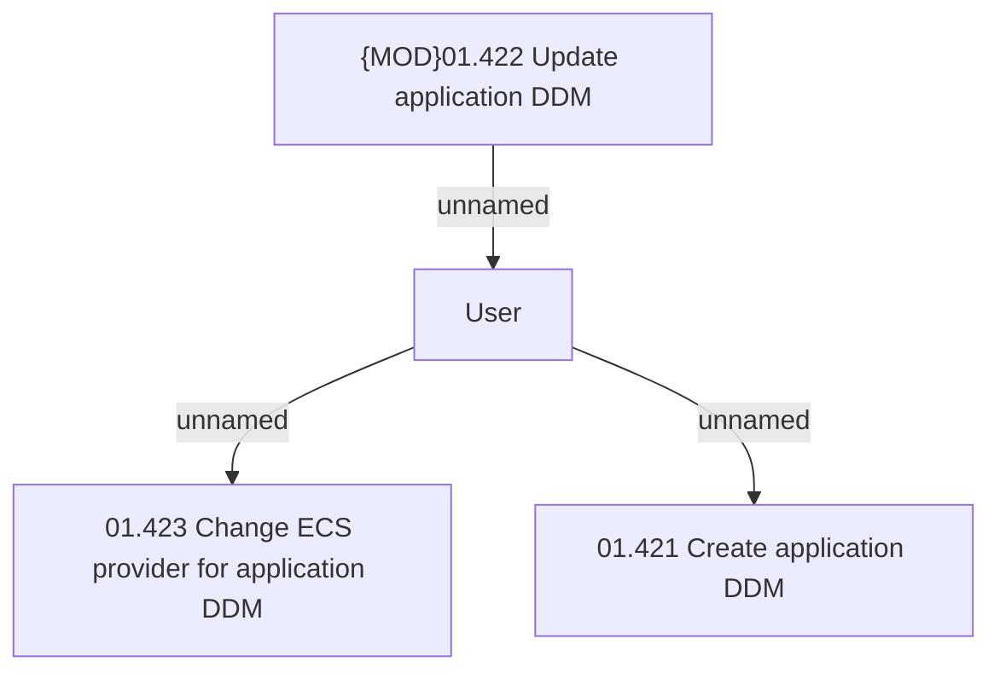

# Direct debit mandates

```mermaid
graph TD
    n_01_421_Create_application_DDM["01.421 Create application DDM"]
    n_01_423_Change_ECS_provider_for_application_DDM["01.423 Change ECS provider for application DDM"]
    MOD_01_422_Update_application_DDM["{MOD}01.422 Update application DDM"]
    User["User"]
    MOD_01_422_Update_application_DDM -->|unnamed| User
    User -->|unnamed| n_01_423_Change_ECS_provider_for_application_DDM
    User -->|unnamed| n_01_421_Create_application_DDM
```
