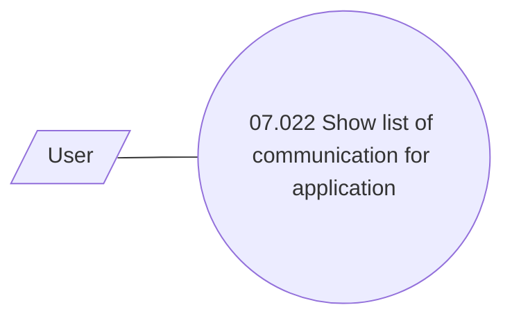

# List of communication

- **Diagram Type**: Use Case
- **Package**: HomerSelect/BSL/Analysis Model/Contract Origination/Application detail/Use Case Model/List of communication
- **Diagram ID**: 149833
- **Elements**: 2
- **Connectors**: 1

