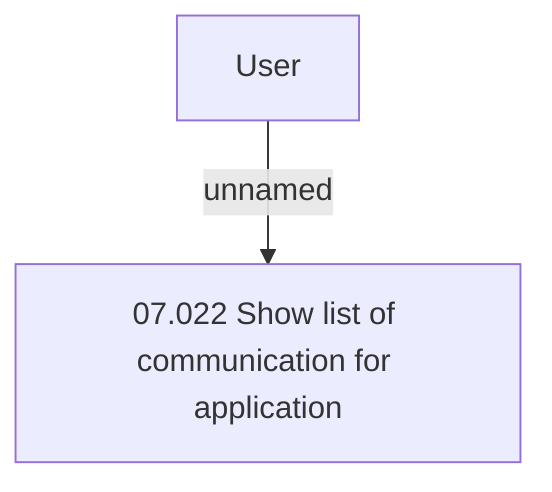

# List of communication

```mermaid
graph TD
    User["User"]
    n_07_022_Show_list_of_communication_for_application["07.022 Show list of communication for application"]
    User -->|unnamed| n_07_022_Show_list_of_communication_for_application
```
