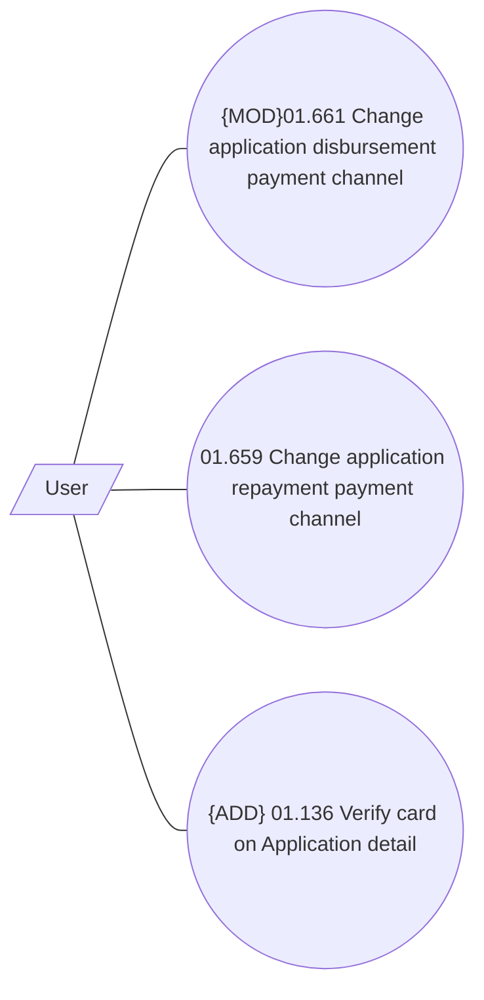

# Payment channels

- **Diagram Type**: Use Case
- **Package**: HomerSelect/BSL/Analysis Model/Contract Origination/Application detail/Use Case Model/Payment channels
- **Diagram ID**: 159640
- **Elements**: 4
- **Connectors**: 3

