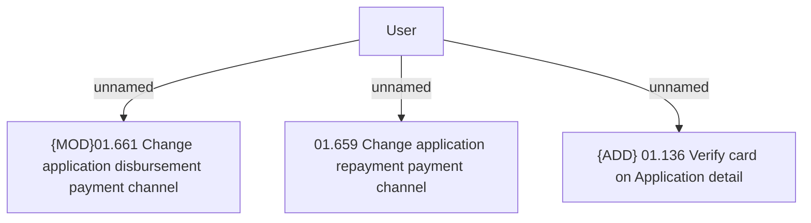

# Payment channels

```mermaid
graph TD
    ADD_01_136_Verify_card_on_Application_detail["{ADD} 01.136 Verify card on Application detail"]
    MOD_01_661_Change_application_disbursement_payment_channel["{MOD}01.661 Change application disbursement payment channel"]
    n_01_659_Change_application_repayment_payment_channel["01.659 Change application repayment payment channel"]
    User["User"]
    User -->|unnamed| MOD_01_661_Change_application_disbursement_payment_channel
    User -->|unnamed| n_01_659_Change_application_repayment_payment_channel
    User -->|unnamed| ADD_01_136_Verify_card_on_Application_detail
```
