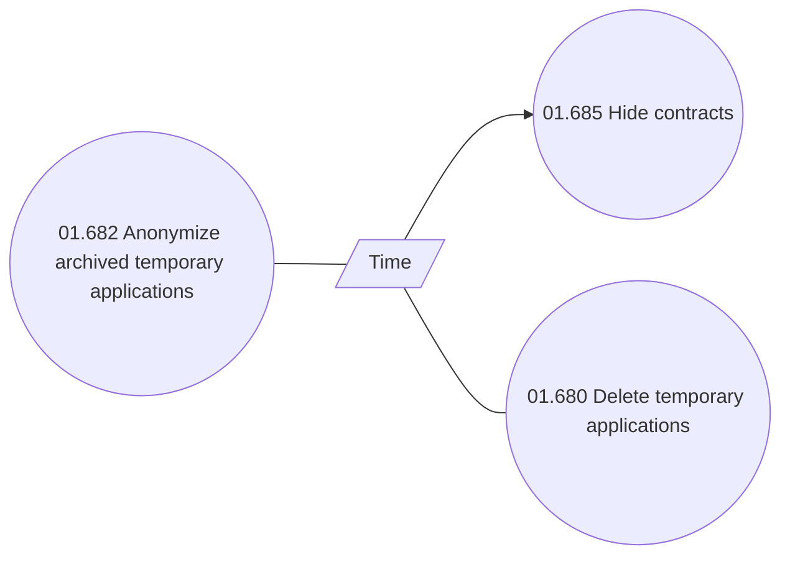

# Automatic jobs

- **Diagram Type**: Use Case
- **Package**: HomerSelect/BSL/Analysis Model/Contract Origination/COMMON for Contract origination/UseCase Model
- **Diagram ID**: 151369
- **Elements**: 4
- **Connectors**: 3

