# Contract origination

- **Diagram Type**: Use Case
- **Package**: HomerSelect/BSL/Analysis Model/Contract Origination/COMMON for Contract origination/UseCase Model
- **Diagram ID**: 151367
- **Elements**: 33
- **Connectors**: 43

```mermaid
graph LR
    Determine_Check_moment_type_flag["Determine Check moment type flag"]
    External_Reference["External Reference"]
    External_Reference["External Reference"]
    External_Reference["External Reference"]
    Application_Processing["Application Processing"]
    MOD_01_160_Search_client(("{MOD}01.160 Search client"))
    n_01_080_Fill_in_application(("01.080 Fill in application"))
    Use_Case_Model_Select_insurance_services["Use Case Model : Select insurance services"]
    n_08_110_Select_insurance_services(("08.110 Select insurance services"))
    UseCase_Model_Receive_evaluation_results["UseCase Model : Receive evaluation results"]
    n_01_083_Fill_in_application_2BoD(("01.083 Fill in application - 2BoD"))
    MOD_06_010_Identify_Client(("{MOD}06.010 Identify Client"))
    MOD_01_082_Fill_in_application_1BoD(("{MOD}01.082 Fill in application - 1BoD"))
    MOD_01_300_Search_for_contract(("{MOD}01.300 Search for contract"))
    Algorithm_Select_sales_process_type["Algorithm: Select sales process type"]
    UseCase_Model_01_020_Create_contract_1SP["UseCase Model : 01.020 Create contract - 1SP"]
    UseCase_Model_Client_update["UseCase Model : Client update"]
    UseCase_Model_Contract_detail["UseCase Model : Contract detail"]
    UseCase_Model_Send_to_evaluation["UseCase Model : Send to evaluation"]
    UseCase_Model_Send_to_evaluation["UseCase Model : Send to evaluation"]
    UseCase_Model_Client_identification["UseCase Model : Client identification"]
    UseCase_Model_Choose_product_offer["UseCase Model : Choose product offer"]
    MOD_01_081_Fill_in_application_1SP(("{MOD}01.081 Fill in application - 1SP"))
    n_06_020_Update_Client_Data(("06.020 Update Client Data"))
    Contract_origination_2SP_Fill_in_application_2SP["Contract origination - 2SP :Fill in application - 2SP"]
    Contract_origination_2SP_Fill_in_application_2SP["Contract origination - 2SP :Fill in application - 2SP"]
    MOD_01_020_Create_contract(("{MOD}01.020 Create contract"))
    Algorithm_Decide_who_will_fill_in_the_second_block_of_data["Algorithm: Decide who will fill in the second block of data"]
    n_01_151_Send_to_preliminary_evaluation(("01.151 Send to preliminary evaluation"))
    MOD_01_210_Show_contract_detail(("{MOD}01.210 Show contract detail"))
    n_01_010_Choose_product_offer(("01.010 Choose product offer"))
    User[/"User"/]
    n_01_150_Send_to_application_evaluation(("01.150 Send to application evaluation"))
    MOD_01_020_Create_contract -.->|include| MOD_01_082_Fill_in_application_1BoD
    MOD_01_160_Search_client -->|unnamed| n_01_080_Fill_in_application
    MOD_01_081_Fill_in_application_1SP --> n_01_080_Fill_in_application
    MOD_01_020_Create_contract -.->|include| MOD_01_160_Search_client
    External_Reference -->|External Reference| External_Reference
    Use_Case_Model_Select_insurance_services -->|unnamed| n_08_110_Select_insurance_services
    MOD_01_020_Create_contract --- User
    MOD_01_020_Create_contract -.->|include| n_01_010_Choose_product_offer
    MOD_01_160_Search_client -->|unnamed| n_01_010_Choose_product_offer
    UseCase_Model_Choose_product_offer -->|unnamed| n_01_010_Choose_product_offer
    UseCase_Model_Contract_detail -->|unnamed| MOD_01_210_Show_contract_detail
    MOD_01_020_Create_contract -->|unnamed| Algorithm_Select_sales_process_type
    UseCase_Model_01_020_Create_contract_1SP -->|unnamed| MOD_01_020_Create_contract
    UseCase_Model_Client_update -->|unnamed| n_06_020_Update_Client_Data
    n_01_010_Choose_product_offer -.->|include| MOD_01_082_Fill_in_application_1BoD
    n_01_010_Choose_product_offer -->|unnamed| MOD_01_081_Fill_in_application_1SP
    n_01_080_Fill_in_application -.->|include| n_06_020_Update_Client_Data
    n_01_080_Fill_in_application -->|unnamed| Determine_Check_moment_type_flag
    n_01_080_Fill_in_application -->|unnamed| n_01_151_Send_to_preliminary_evaluation
    n_01_080_Fill_in_application -->|unnamed| MOD_06_010_Identify_Client
    n_01_080_Fill_in_application -->|unnamed| Application_Processing
    n_01_080_Fill_in_application -->|unnamed| n_01_150_Send_to_application_evaluation
    Application_Processing -->|unnamed| Determine_Check_moment_type_flag
    User --- MOD_01_210_Show_contract_detail
    User --> n_01_010_Choose_product_offer
    User --- n_01_083_Fill_in_application_2BoD
    User --- MOD_01_082_Fill_in_application_1BoD
    User --> n_08_110_Select_insurance_services
    User --> MOD_01_160_Search_client
    User --> MOD_01_300_Search_for_contract
    MOD_01_300_Search_for_contract -->|unnamed| MOD_01_210_Show_contract_detail
    MOD_01_300_Search_for_contract -->|unnamed| n_01_083_Fill_in_application_2BoD
    MOD_06_010_Identify_Client --> n_06_020_Update_Client_Data
    MOD_06_010_Identify_Client -->|unnamed| n_01_151_Send_to_preliminary_evaluation
    MOD_06_010_Identify_Client -->|unnamed| n_01_150_Send_to_application_evaluation
    n_01_083_Fill_in_application_2BoD -->|unnamed| Algorithm_Decide_who_will_fill_in_the_second_block_of_data
    n_01_083_Fill_in_application_2BoD -.->|include| n_01_080_Fill_in_application
    MOD_01_082_Fill_in_application_1BoD -.->|include| n_01_080_Fill_in_application
    n_01_083_Fill_in_application_2BoD -->|unnamed| Contract_origination_2SP_Fill_in_application_2SP
    MOD_01_082_Fill_in_application_1BoD -->|unnamed| Contract_origination_2SP_Fill_in_application_2SP
    MOD_06_010_Identify_Client -->|unnamed| UseCase_Model_Client_identification
    n_01_150_Send_to_application_evaluation -->|unnamed| UseCase_Model_Send_to_evaluation
    n_01_151_Send_to_preliminary_evaluation -->|unnamed| UseCase_Model_Send_to_evaluation
```

