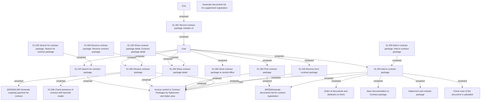

# Contract tracking

```mermaid
graph TD
    TCK["TCK"]
    n_01_281_Record_contract_package_mistake_v2["01.281 Record contract package mistake v2"]
    Check_scan_of_the_document_is_uploaded["Check scan of the document is uploaded"]
    Save_documentation_to_Contract_package["Save documentation to Contract package"]
    MOD_05_090_Generate_outgoing_payment_for_contract["{MOD}05.090 Generate outgoing payment for contract"]
    n_01_266_Check_presence_of_contract_with_barcode_reader["01.266 Check presence of contract with barcode reader"]
    Salesroom_and_contract_package["Salesroom and contract package"]
    Order_of_documents_and_attributes_on_them["Order of documents and attributes on them"]
    Access_control_to_Contract_Packages_by_Salesroom_and_Sales_a["Access control to Contract Packages by Salesroom and Sales area"]
    n_01_265_Receive_contract_package_Receive_contract_package["01.265 Receive contract package :Receive contract package"]
    n_01_230_Show_contract_package_detail_Contract_package_detai["01.230 Show contract package detail :Contract package detail"]
    n_01_220_Search_for_contract_package_Search_for_contract_pac["01.220 Search for contract package :Search for contract package"]
    n_01_265_Receive_contract_package["01.265 Receive contract package"]
    n_01_200_Add_to_contract_package["01.200 Add to contract package"]
    n_01_240_Remove_from_contract_package["01.240 Remove from contract package"]
    n_01_260_Send_contract_package_to_central_office["01.260 Send contract package to central office"]
    MOD_Generate_documents_list_for_contract_registration["{MOD}Generate documents list for contract registration"]
    n_01_250_Print_contract_package["01.250 Print contract package"]
    n_01_230_Show_contract_package_detail["01.230 Show contract package detail"]
    n_01_220_Search_for_contract_package["01.220 Search for contract package"]
    User["User"]
    n_01_200_Add_to_contract_package_Add_to_contract_package["01.200 Add to contract package :Add to contract package"]
    Generate_documents_list_for_supplement_registration["Generate documents list for supplement registration"]
    n_01_240_Remove_from_contract_package -->|unnamed| Access_control_to_Contract_Packages_by_Salesroom_and_Sales_a
    n_01_281_Record_contract_package_mistake_v2 -->|unnamed| User
    n_01_265_Receive_contract_package_Receive_contract_package -->|unnamed| n_01_265_Receive_contract_package
    n_01_230_Show_contract_package_detail_Contract_package_detai -->|unnamed| n_01_230_Show_contract_package_detail
    n_01_220_Search_for_contract_package_Search_for_contract_pac -->|unnamed| n_01_220_Search_for_contract_package
    n_01_265_Receive_contract_package -->|unnamed| MOD_05_090_Generate_outgoing_payment_for_contract
    n_01_265_Receive_contract_package -->|unnamed| Access_control_to_Contract_Packages_by_Salesroom_and_Sales_a
    n_01_265_Receive_contract_package -->|unnamed| n_01_266_Check_presence_of_contract_with_barcode_reader
    n_01_200_Add_to_contract_package -->|unnamed| Order_of_documents_and_attributes_on_them
    n_01_200_Add_to_contract_package -->|unnamed| MOD_Generate_documents_list_for_contract_registration
    n_01_200_Add_to_contract_package -->|unnamed| Save_documentation_to_Contract_package
    n_01_200_Add_to_contract_package -->|unnamed| Access_control_to_Contract_Packages_by_Salesroom_and_Sales_a
    n_01_200_Add_to_contract_package -->|unnamed| Salesroom_and_contract_package
    n_01_200_Add_to_contract_package_Add_to_contract_package -->|unnamed| n_01_200_Add_to_contract_package
    n_01_260_Send_contract_package_to_central_office -->|unnamed| Access_control_to_Contract_Packages_by_Salesroom_and_Sales_a
    n_01_250_Print_contract_package -->|unnamed| Access_control_to_Contract_Packages_by_Salesroom_and_Sales_a
    n_01_250_Print_contract_package -->|unnamed| MOD_Generate_documents_list_for_contract_registration
    n_01_230_Show_contract_package_detail -->|unnamed| Access_control_to_Contract_Packages_by_Salesroom_and_Sales_a
    n_01_220_Search_for_contract_package -->|unnamed| Access_control_to_Contract_Packages_by_Salesroom_and_Sales_a
    n_01_200_Add_to_contract_package -->|unnamed| Check_scan_of_the_document_is_uploaded
    TCK -->|unnamed| n_01_281_Record_contract_package_mistake_v2
    User -->|unnamed| n_01_260_Send_contract_package_to_central_office
    User -->|unnamed| n_01_250_Print_contract_package
    User -->|unnamed| n_01_265_Receive_contract_package
    User -->|unnamed| n_01_230_Show_contract_package_detail
    User -->|unnamed| n_01_200_Add_to_contract_package
    User -->|unnamed| n_01_240_Remove_from_contract_package
    User -->|unnamed| n_01_220_Search_for_contract_package
```
