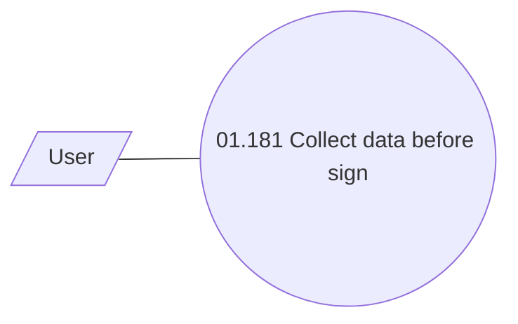

# Collect data before sign

- **Diagram Type**: Use Case
- **Package**: HomerSelect/BSL/Analysis Model/Contract Origination/Contract signing/Collect data before sign/UseCase Model
- **Diagram ID**: 111687
- **Elements**: 2
- **Connectors**: 1

