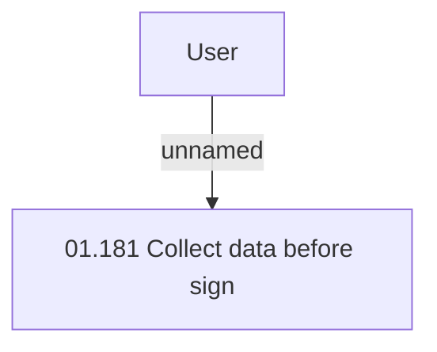

# Collect data before sign

```mermaid
graph TD
    User["User"]
    n_01_181_Collect_data_before_sign["01.181 Collect data before sign"]
    User -->|unnamed| n_01_181_Collect_data_before_sign
```
