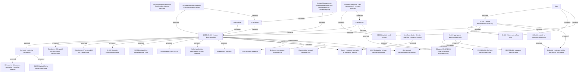

# Prepare documentation to sign

```mermaid
graph TD
    Get_contract_documentation_documents["Get contract documentation documents"]
    Get_consolidation_amounts_for_internal_refinanced_contracts["Get consolidation amounts for internal refinanced contracts"]
    Validate_IMEI_internally["Validate IMEI internally"]
    Select_application_commodities_for_IMEI_validation["Select application commodities for IMEI validation"]
    Recalculate_Annuity_in_OFP["Recalculate Annuity in OFP"]
    MOD_Evaluate_First_Installment_Due_Date["{MOD}Evaluate First Installment Due Date"]
    n_03_010_Generate_installment_schedule["03.010 Generate installment schedule"]
    Calculation_of_Presented_IR_for_Product_Offer["Calculation of Presented IR for Product Offer"]
    MOD_01_186_Prepare_documentation["{MOD}01.186 Prepare documentation"]
    Generate_content_of_agreement["Generate content of agreement"]
    n_01_181_Collect_data_before_sign["01.181 Collect data before sign"]
    diagram_146529A4_022E_453d_8E46_9F9C0F62BAA0["$diagram://{146529A4-022E-453d-8E46-9F9C0F62BAA0}"]
    Disbursement_amount_validation_rule["Disbursement amount validation rule"]
    Consolidation_amount_validation_rule["Consolidation amount validation rule"]
    Calculation_of_financial_parameters_for_consolidation["Calculation of financial parameters for consolidation"]
    Calculate_maximum_validity_of_prepared_documents["Calculate maximum validity of prepared documents"]
    CaBus_CMS["CaBus-CMS"]
    Get_data_for_data_source_generation_from_other_modules["Get data for data source generation from other modules"]
    CalculateInstalmentSchedule_CalculateInstalmentPlan["CalculateInstalmentSchedule :CalculateInstalmentPlan"]
    Account_Management_AccountManagementWS_Interface_diagram_Con["Account Management : AccountManagementWS - Interface diagram - Contract signing"]
    Card_Management_Card_management_Interface_diagram["Card Management : Card management - Interface diagram"]
    Calculate_validity_of_prepared_documents["Calculate validity of prepared documents"]
    Use_Case_Model_Create_and_Sign_Insurance_contract["Use Case Model : Create and Sign Insurance contract"]
    MOD_Calculation_of_Loan_Service_parameters["{MOD}Calculation of Loan Service parameters"]
    Print_Server["Print Server"]
    Create_insurance_contracts_for_insurance_services["Create insurance contracts for insurance services"]
    n_01_009_Upload_file_to_document_archive["01.009 Upload file to document archive"]
    n_01_006_Delete_file_from_document_archive["01.006 Delete file from document archive"]
    n_11_090_Delete_insurance_contract_draft["11.090 Delete insurance contract draft"]
    Deleting_prepared_documentation_rule["Deleting prepared documentation rule"]
    n_01_182_Prepare_documentation_manually["01.182 Prepare documentation manually"]
    n_01_185_Validate_card_number["01.185 Validate card number"]
    DDM_attributes_validation["DDM attributes validation"]
    User["User"]
    CaBus_AM["CaBus-AM"]
    n_01_185_Validate_card_number -->|unnamed| diagram_146529A4_022E_453d_8E46_9F9C0F62BAA0
    n_01_182_Prepare_documentation_manually -->|unnamed| n_01_181_Collect_data_before_sign
    MOD_01_186_Prepare_documentation -->|unnamed| Generate_content_of_agreement
    CalculateInstalmentSchedule_CalculateInstalmentPlan -->|unnamed| MOD_01_186_Prepare_documentation
    n_01_182_Prepare_documentation_manually -->|unnamed| MOD_01_186_Prepare_documentation
    MOD_01_186_Prepare_documentation -->|unnamed| Calculation_of_financial_parameters_for_consolidation
    MOD_01_186_Prepare_documentation -->|unnamed| Calculation_of_Presented_IR_for_Product_Offer
    MOD_01_186_Prepare_documentation -->|unnamed| n_03_010_Generate_installment_schedule
    MOD_01_186_Prepare_documentation -->|unnamed| MOD_Evaluate_First_Installment_Due_Date
    MOD_01_186_Prepare_documentation -->|unnamed| Recalculate_Annuity_in_OFP
    MOD_01_186_Prepare_documentation -->|unnamed| Select_application_commodities_for_IMEI_validation
    MOD_01_186_Prepare_documentation -->|unnamed| Validate_IMEI_internally
    MOD_01_186_Prepare_documentation -->|unnamed| Get_contract_documentation_documents
    Account_Management_AccountManagementWS_Interface_diagram_Con -->|unnamed| MOD_01_186_Prepare_documentation
    MOD_01_186_Prepare_documentation -->|unnamed| Create_insurance_contracts_for_insurance_services
    CalculateInstalmentSchedule_CalculateInstalmentPlan -->|unnamed| CaBus_AM
    MOD_01_186_Prepare_documentation -->|unnamed| DDM_attributes_validation
    Card_Management_Card_management_Interface_diagram -->|unnamed| n_01_185_Validate_card_number
    n_01_182_Prepare_documentation_manually -->|unnamed| Deleting_prepared_documentation_rule
    MOD_01_186_Prepare_documentation -->|unnamed| Disbursement_amount_validation_rule
    MOD_01_186_Prepare_documentation -->|unnamed| Consolidation_amount_validation_rule
    Use_Case_Model_Create_and_Sign_Insurance_contract -->|unnamed| Create_insurance_contracts_for_insurance_services
    MOD_01_186_Prepare_documentation -->|unnamed| MOD_Calculation_of_Loan_Service_parameters
    n_01_182_Prepare_documentation_manually -->|unnamed| Calculate_validity_of_prepared_documents
    Card_Management_Card_management_Interface_diagram -->|unnamed| CaBus_CMS
    n_01_182_Prepare_documentation_manually -->|unnamed| Calculate_maximum_validity_of_prepared_documents
    Account_Management_AccountManagementWS_Interface_diagram_Con -->|unnamed| CaBus_AM
    Deleting_prepared_documentation_rule -->|unnamed| n_01_006_Delete_file_from_document_archive
    Deleting_prepared_documentation_rule -->|unnamed| n_11_090_Delete_insurance_contract_draft
    Deleting_prepared_documentation_rule -->|unnamed| Get_contract_documentation_documents
    Generate_content_of_agreement -->|unnamed| Get_data_for_data_source_generation_from_other_modules
    Calculate_validity_of_prepared_documents -->|unnamed| Calculate_maximum_validity_of_prepared_documents
    Generate_content_of_agreement -->|unnamed| n_01_009_Upload_file_to_document_archive
    CaBus_CMS -->|unnamed| MOD_01_186_Prepare_documentation
    CaBus_CMS -->|unnamed| n_01_185_Validate_card_number
    User -->|unnamed| n_01_182_Prepare_documentation_manually
    User -->|unnamed| n_01_181_Collect_data_before_sign
    User -->|unnamed| n_01_185_Validate_card_number
    CaBus_AM -->|unnamed| MOD_01_186_Prepare_documentation
    Print_Server -->|unnamed| MOD_01_186_Prepare_documentation
    CaBus_CMS -->|unnamed| diagram_146529A4_022E_453d_8E46_9F9C0F62BAA0
```
