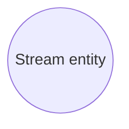

# Use case model

- **Diagram Type**: Use Case
- **Package**: HomerSelect/BSL/Analysis Model/Contract Origination/Entity streaming/Use case model
- **Diagram ID**: 150116
- **Elements**: 1
- **Connectors**: 0

