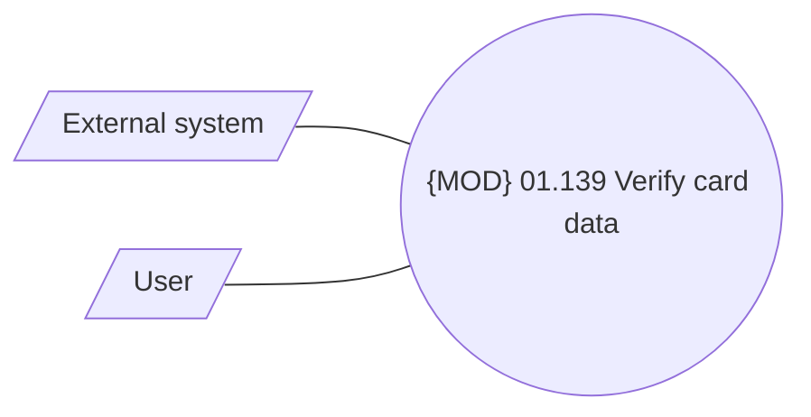

# Card evidence

- **Diagram Type**: Use Case
- **Package**: HomerSelect/BSL/Analysis Model/Contract Origination/Fill in application/COMMON for Fill in application/UseCase Model - Fill in application
- **Diagram ID**: 158415
- **Elements**: 3
- **Connectors**: 2

