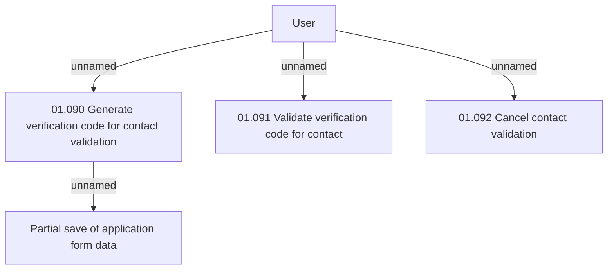

# Contact verification

```mermaid
graph TD
    Partial_save_of_application_form_data["Partial save of application form data"]
    n_01_090_Generate_verification_code_for_contact_validation["01.090 Generate verification code for contact validation"]
    n_01_091_Validate_verification_code_for_contact["01.091 Validate verification code for contact"]
    n_01_092_Cancel_contact_validation["01.092 Cancel contact validation"]
    User["User"]
    User -->|unnamed| n_01_091_Validate_verification_code_for_contact
    User -->|unnamed| n_01_090_Generate_verification_code_for_contact_validation
    User -->|unnamed| n_01_092_Cancel_contact_validation
    n_01_090_Generate_verification_code_for_contact_validation -->|unnamed| Partial_save_of_application_form_data
```
