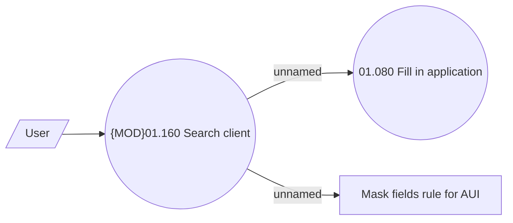

# Client search

- **Diagram Type**: Use Case
- **Package**: HomerSelect/BSL/Analysis Model/Contract Origination/Fill in application/Client search/Use Case model
- **Diagram ID**: 150547
- **Elements**: 4
- **Connectors**: 3

