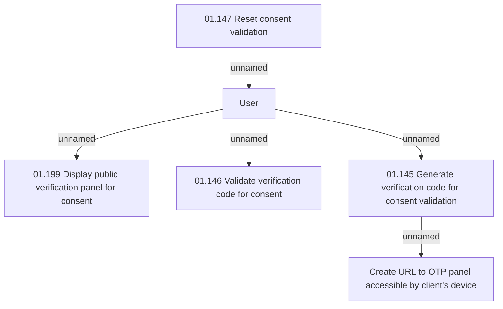

# Use Case Model - consent verification

```mermaid
graph TD
    Create_URL_to_OTP_panel_accessible_by_client_s_device["Create URL to OTP panel accessible by client's device"]
    n_01_199_Display_public_verification_panel_for_consent["01.199 Display public verification panel for consent"]
    n_01_147_Reset_consent_validation["01.147 Reset consent validation"]
    n_01_146_Validate_verification_code_for_consent["01.146 Validate verification code for consent"]
    User["User"]
    n_01_145_Generate_verification_code_for_consent_validation["01.145 Generate verification code for consent validation"]
    n_01_145_Generate_verification_code_for_consent_validation -->|unnamed| Create_URL_to_OTP_panel_accessible_by_client_s_device
    n_01_147_Reset_consent_validation -->|unnamed| User
    User -->|unnamed| n_01_199_Display_public_verification_panel_for_consent
    User -->|unnamed| n_01_145_Generate_verification_code_for_consent_validation
    User -->|unnamed| n_01_146_Validate_verification_code_for_consent
```
