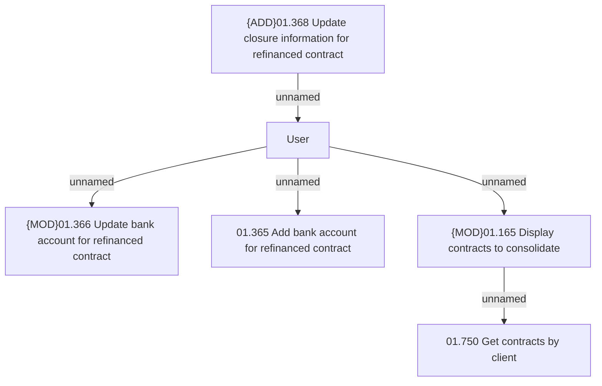

# Consolidation Use case

```mermaid
graph TD
    ADD_01_368_Update_closure_information_for_refinanced_contrac["{ADD}01.368 Update closure information for refinanced contract"]
    MOD_01_366_Update_bank_account_for_refinanced_contract["{MOD}01.366 Update bank account for refinanced contract"]
    n_01_365_Add_bank_account_for_refinanced_contract["01.365 Add bank account for refinanced contract"]
    n_01_750_Get_contracts_by_client["01.750 Get contracts by client"]
    User["User"]
    MOD_01_165_Display_contracts_to_consolidate["{MOD}01.165 Display contracts to consolidate"]
    MOD_01_165_Display_contracts_to_consolidate -->|unnamed| n_01_750_Get_contracts_by_client
    ADD_01_368_Update_closure_information_for_refinanced_contrac -->|unnamed| User
    User -->|unnamed| MOD_01_165_Display_contracts_to_consolidate
    User -->|unnamed| n_01_365_Add_bank_account_for_refinanced_contract
    User -->|unnamed| MOD_01_366_Update_bank_account_for_refinanced_contract
```
