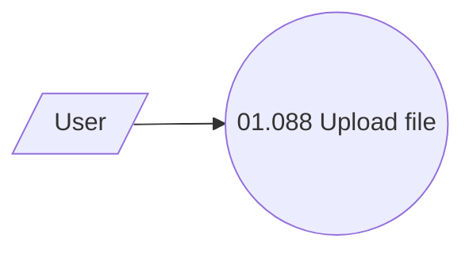

# File upload - use case

- **Diagram Type**: Use Case
- **Package**: HomerSelect/BSL/Analysis Model/Contract Origination/Fill in application/File upload/Use case
- **Diagram ID**: 158255
- **Elements**: 2
- **Connectors**: 1

