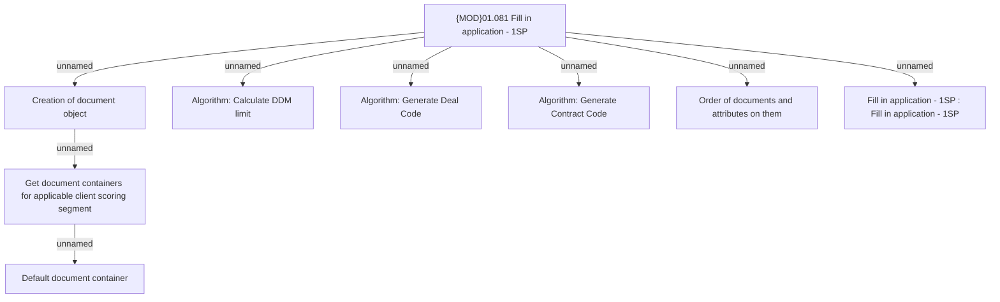

# Fill in application - 1SP

```mermaid
graph TD
    Default_document_container["Default document container"]
    Get_document_containers_for_applicable_client_scoring_segmen["Get document containers for applicable client scoring segment"]
    Creation_of_document_object["Creation of document object"]
    Algorithm_Calculate_DDM_limit["Algorithm: Calculate DDM limit"]
    Algorithm_Generate_Deal_Code["Algorithm: Generate Deal Code"]
    Algorithm_Generate_Contract_Code["Algorithm: Generate Contract Code"]
    Order_of_documents_and_attributes_on_them["Order of documents and attributes on them"]
    Fill_in_application_1SP_Fill_in_application_1SP["Fill in application - 1SP : Fill in application - 1SP"]
    MOD_01_081_Fill_in_application_1SP["{MOD}01.081 Fill in application - 1SP"]
    MOD_01_081_Fill_in_application_1SP -->|unnamed| Fill_in_application_1SP_Fill_in_application_1SP
    MOD_01_081_Fill_in_application_1SP -->|unnamed| Order_of_documents_and_attributes_on_them
    MOD_01_081_Fill_in_application_1SP -->|unnamed| Algorithm_Generate_Contract_Code
    MOD_01_081_Fill_in_application_1SP -->|unnamed| Algorithm_Generate_Deal_Code
    MOD_01_081_Fill_in_application_1SP -->|unnamed| Algorithm_Calculate_DDM_limit
    MOD_01_081_Fill_in_application_1SP -->|unnamed| Creation_of_document_object
    Get_document_containers_for_applicable_client_scoring_segmen -->|unnamed| Default_document_container
    Creation_of_document_object -->|unnamed| Get_document_containers_for_applicable_client_scoring_segmen
```
