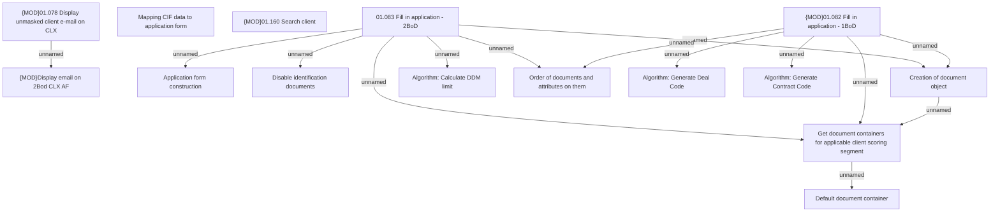

# Fill in application - 2SP

```mermaid
graph TD
    MOD_Display_email_on_2Bod_CLX_AF["{MOD}Display email on 2Bod CLX AF"]
    MOD_01_078_Display_unmasked_client_e_mail_on_CLX["{MOD}01.078 Display unmasked client e-mail on CLX"]
    Default_document_container["Default document container"]
    Get_document_containers_for_applicable_client_scoring_segmen["Get document containers for applicable client scoring segment"]
    Mapping_CIF_data_to_application_form["Mapping CIF data to application form"]
    MOD_01_160_Search_client["{MOD}01.160 Search client"]
    Application_form_construction["Application form construction"]
    Disable_identification_documents["Disable identification documents"]
    Creation_of_document_object["Creation of document object"]
    Algorithm_Calculate_DDM_limit["Algorithm: Calculate DDM limit"]
    Order_of_documents_and_attributes_on_them["Order of documents and attributes on them"]
    Algorithm_Generate_Deal_Code["Algorithm: Generate Deal Code"]
    Algorithm_Generate_Contract_Code["Algorithm: Generate Contract Code"]
    MOD_01_082_Fill_in_application_1BoD["{MOD}01.082 Fill in application - 1BoD"]
    n_01_083_Fill_in_application_2BoD["01.083 Fill in application - 2BoD"]
    n_01_083_Fill_in_application_2BoD -->|unnamed| Application_form_construction
    n_01_083_Fill_in_application_2BoD -->|unnamed| Get_document_containers_for_applicable_client_scoring_segmen
    n_01_083_Fill_in_application_2BoD -->|unnamed| Disable_identification_documents
    n_01_083_Fill_in_application_2BoD -->|unnamed| Algorithm_Calculate_DDM_limit
    n_01_083_Fill_in_application_2BoD -->|unnamed| Order_of_documents_and_attributes_on_them
    n_01_083_Fill_in_application_2BoD -->|unnamed| Creation_of_document_object
    MOD_01_082_Fill_in_application_1BoD -->|unnamed| Creation_of_document_object
    MOD_01_082_Fill_in_application_1BoD -->|unnamed| Get_document_containers_for_applicable_client_scoring_segmen
    MOD_01_082_Fill_in_application_1BoD -->|unnamed| Algorithm_Generate_Deal_Code
    MOD_01_082_Fill_in_application_1BoD -->|unnamed| Algorithm_Generate_Contract_Code
    MOD_01_082_Fill_in_application_1BoD -->|unnamed| Order_of_documents_and_attributes_on_them
    MOD_01_078_Display_unmasked_client_e_mail_on_CLX -->|unnamed| MOD_Display_email_on_2Bod_CLX_AF
    Get_document_containers_for_applicable_client_scoring_segmen -->|unnamed| Default_document_container
    Creation_of_document_object -->|unnamed| Get_document_containers_for_applicable_client_scoring_segmen
```
