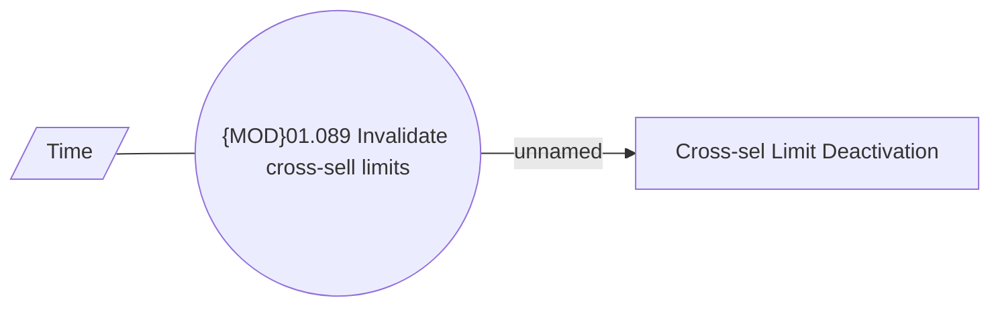

# Invalidate cross-sell limit

- **Diagram Type**: Use Case
- **Package**: HomerSelect/BSL/Analysis Model/Contract Origination/Fill in application/Fill in application - 2SP/UseCase Model
- **Diagram ID**: 157370
- **Elements**: 3
- **Connectors**: 2

