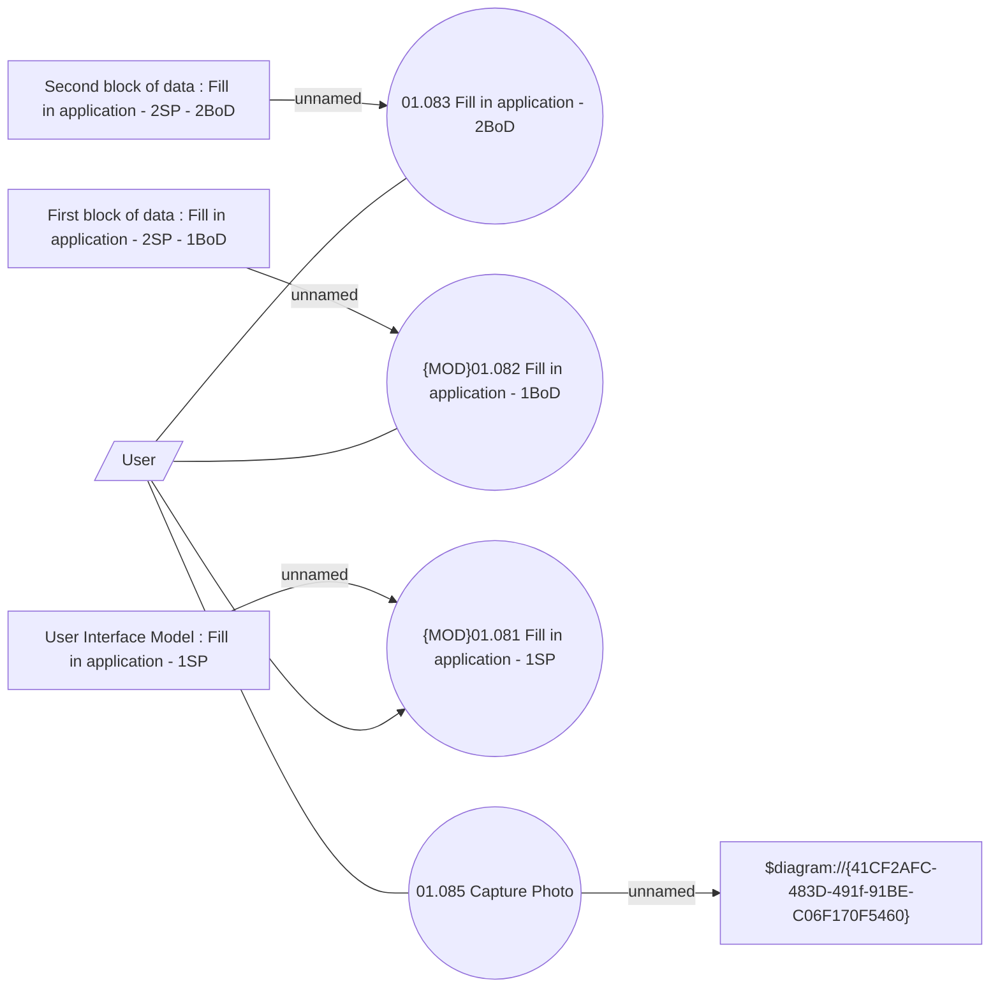

# Photo component

- **Diagram Type**: Use Case
- **Package**: HomerSelect/BSL/Analysis Model/Contract Origination/Fill in application/Photo component/UseCase Model
- **Diagram ID**: 147371
- **Elements**: 9
- **Connectors**: 8

