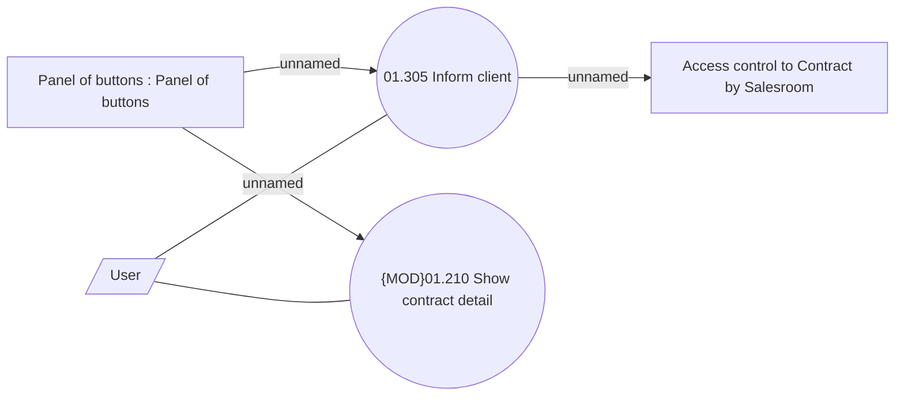

# Inform client

- **Diagram Type**: Use Case
- **Package**: HomerSelect/BSL/Analysis Model/Contract Origination/Inform client/UseCase Model
- **Diagram ID**: 46427
- **Elements**: 5
- **Connectors**: 5

