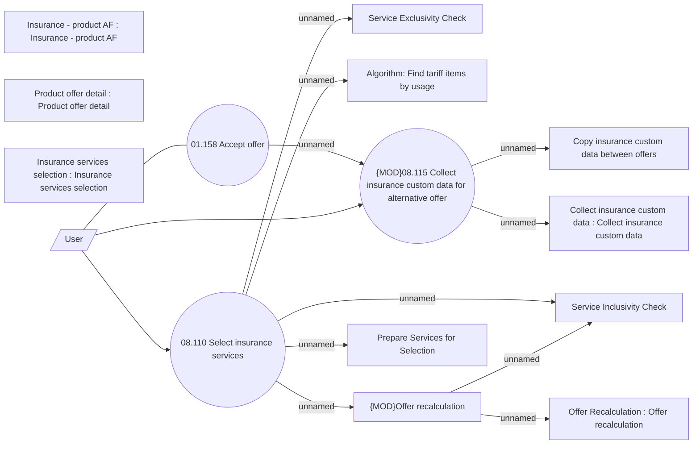

# Select insurance services

- **Diagram Type**: Use Case
- **Package**: HomerSelect/BSL/Analysis Model/Contract Origination/Insurance and Service Origination/Use Case Model
- **Diagram ID**: 158219
- **Elements**: 15
- **Connectors**: 13

