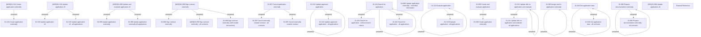

# Access Rights

```mermaid
graph TD
    n_01_164_Search_for_application_without_search_criteria["01.164 Search for application - without search criteria"]
    n_01_134_Create_application_externally["01.134 Create application externally"]
    n_01_385_Assign_card_to_application_externally["01.385 Assign card to application externally"]
    n_01_385_Assign_card_to_application_externally["01.385 Assign card to application externally"]
    n_01_310_Update_application_v9_all_applications["01.310 Update application v9 - all applications"]
    n_01_310_Update_application_v9["01.310 Update application v9"]
    MOD_01_310_Update_application_v9["{MOD}01.310 Update application v9"]
    n_01_312_Update_approved_application_all_applications["01.312 Update approved application - all applications"]
    n_01_312_Update_approved_application["01.312 Update approved application"]
    n_01_312_Update_approved_application["01.312 Update approved application"]
    n_01_313_Evaluate_application_all_applications["01.313 Evaluate application - all applications"]
    n_01_313_Evaluate_application["01.313 Evaluate application"]
    n_01_313_Evaluate_application["01.313 Evaluate application"]
    n_01_311_Update_offer_to_application_and_evaluate_all_applic["01.311 Update offer to application and evaluate - all applications"]
    n_01_311_Update_offer_to_application_and_evaluate["01.311 Update offer to application and evaluate"]
    n_01_311_Update_offer_to_application_and_evaluate["01.311 Update offer to application and evaluate"]
    MOD_01_098_Update_and_evaluate_application_v9["{MOD}01.098 Update and evaluate application v9"]
    n_01_164_Search_for_application["01.164 Search for application"]
    n_01_164_Search_for_application_all_applications["01.164 Search for application - all applications"]
    n_01_164_Search_for_application["01.164 Search for application"]
    n_01_098_Update_application_externally_extended_information["01.098 Update application externally - extended information"]
    n_01_040_Get_application_data_all_contracts["01.040 Get application data - all contracts"]
    n_01_040_Get_application_data["01.040 Get application data"]
    n_01_040_Get_application_data["01.040 Get application data"]
    n_01_098_Update_application_externally_all_applications["01.098 Update application externally-all applications"]
    n_01_098_Update_application_externally["01.098 Update application externally"]
    n_01_096_Prepare_documentation_externally["01.096 Prepare documentation externally"]
    n_01_099_Sign_contract_externally_with_invalid_documents["01.099 Sign contract externally (with invalid documents)"]
    ADD_01_099_Sign_contract_externally_all_contracts["{ADD}01.099 Sign contract externally - all contracts"]
    n_01_097_Cancel_externally_created_contract_all_contracts["01.097 Cancel externally created contract - all contracts"]
    n_01_096_Prepare_documentation_externally_all_contracts["01.096 Prepare documentation externally - all contracts"]
    MOD_01_099_Sign_contract_externally["{MOD}01.099 Sign contract externally"]
    n_01_099_Sign_contract_externally["01.099 Sign contract externally"]
    n_01_097_Cancel_externally_created_contract["01.097 Cancel externally created contract"]
    n_01_097_Cancel_application_externally["01.097 Cancel application externally"]
    n_01_096_Prepare_documentation_externally["01.096 Prepare documentation externally"]
    n_01_095_Create_application_externally["01.095 Create application externally"]
    MOD_01_314_Create_application_externally["{MOD}01.314 Create application externally"]
    n_01_095_Create_and_evaluate_application["01.095 Create and evaluate application"]
    DEL_01_098_Update_application_v8["{DEL}01.098 Update application v8"]
    External_Reference["External Reference"]
    n_01_164_Search_for_application -->|unnamed| n_01_164_Search_for_application_without_search_criteria
    n_01_164_Search_for_application -->|unnamed| n_01_164_Search_for_application
    n_01_164_Search_for_application -->|unnamed| n_01_164_Search_for_application_all_applications
    n_01_040_Get_application_data -->|unnamed| n_01_040_Get_application_data
    n_01_040_Get_application_data -->|unnamed| n_01_040_Get_application_data_all_contracts
    n_01_095_Create_and_evaluate_application -->|unnamed| n_01_095_Create_application_externally
    MOD_01_310_Update_application_v9 -->|unnamed| n_01_310_Update_application_v9
    MOD_01_310_Update_application_v9 -->|unnamed| n_01_310_Update_application_v9_all_applications
    n_01_313_Evaluate_application -->|unnamed| n_01_313_Evaluate_application
    n_01_313_Evaluate_application -->|unnamed| n_01_313_Evaluate_application_all_applications
    n_01_311_Update_offer_to_application_and_evaluate -->|unnamed| n_01_311_Update_offer_to_application_and_evaluate_all_applic
    n_01_311_Update_offer_to_application_and_evaluate -->|unnamed| n_01_311_Update_offer_to_application_and_evaluate
    n_01_096_Prepare_documentation_externally -->|unnamed| n_01_096_Prepare_documentation_externally
    n_01_096_Prepare_documentation_externally -->|unnamed| n_01_096_Prepare_documentation_externally_all_contracts
    n_01_312_Update_approved_application -->|unnamed| n_01_312_Update_approved_application
    n_01_312_Update_approved_application -->|unnamed| n_01_312_Update_approved_application_all_applications
    MOD_01_098_Update_and_evaluate_application_v9 -->|unnamed| n_01_098_Update_application_externally
    MOD_01_098_Update_and_evaluate_application_v9 -->|unnamed| n_01_098_Update_application_externally_all_applications
    MOD_01_099_Sign_contract_externally -->|unnamed| n_01_099_Sign_contract_externally
    MOD_01_099_Sign_contract_externally -->|unnamed| ADD_01_099_Sign_contract_externally_all_contracts
    MOD_01_099_Sign_contract_externally -->|unnamed| n_01_099_Sign_contract_externally_with_invalid_documents
    MOD_01_314_Create_application_externally -->|unnamed| n_01_134_Create_application_externally
    n_01_097_Cancel_application_externally -->|unnamed| n_01_097_Cancel_externally_created_contract_all_contracts
    n_01_097_Cancel_application_externally -->|unnamed| n_01_097_Cancel_externally_created_contract
    n_01_385_Assign_card_to_application_externally -->|unnamed| n_01_385_Assign_card_to_application_externally
```
