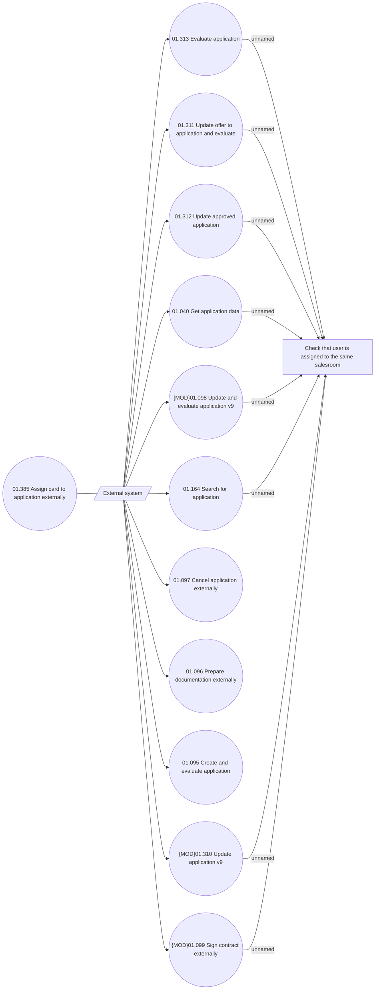

# Use Case

- **Diagram Type**: Use Case
- **Package**: HomerSelect/BSL/Analysis Model/Contract Origination/Interface to external system (eshop)/Contract origination/Application Management/Use Case
- **Diagram ID**: 164451
- **Elements**: 14
- **Connectors**: 20

