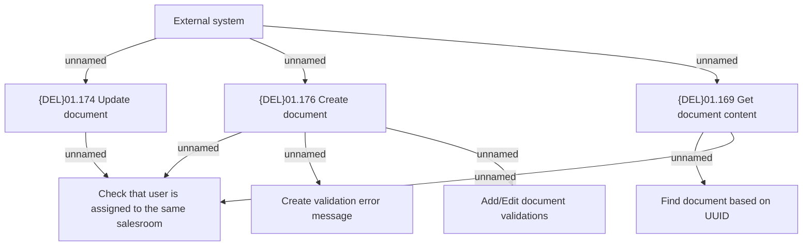

# Use Case

```mermaid
graph TD
    Check_that_user_is_assigned_to_the_same_salesroom["Check that user is assigned to the same salesroom"]
    Find_document_based_on_UUID["Find document based on UUID"]
    DEL_01_176_Create_document["{DEL}01.176 Create document"]
    Create_validation_error_message["Create validation error message"]
    Add_Edit_document_validations["Add/Edit document validations"]
    DEL_01_174_Update_document["{DEL}01.174 Update document"]
    DEL_01_169_Get_document_content["{DEL}01.169 Get document content"]
    External_system["External system"]
    DEL_01_169_Get_document_content -->|unnamed| Find_document_based_on_UUID
    DEL_01_169_Get_document_content -->|unnamed| Check_that_user_is_assigned_to_the_same_salesroom
    DEL_01_174_Update_document -->|unnamed| Check_that_user_is_assigned_to_the_same_salesroom
    DEL_01_176_Create_document -->|unnamed| Check_that_user_is_assigned_to_the_same_salesroom
    DEL_01_176_Create_document -->|unnamed| Create_validation_error_message
    DEL_01_176_Create_document -->|unnamed| Add_Edit_document_validations
    External_system -->|unnamed| DEL_01_174_Update_document
    External_system -->|unnamed| DEL_01_176_Create_document
    External_system -->|unnamed| DEL_01_169_Get_document_content
```
