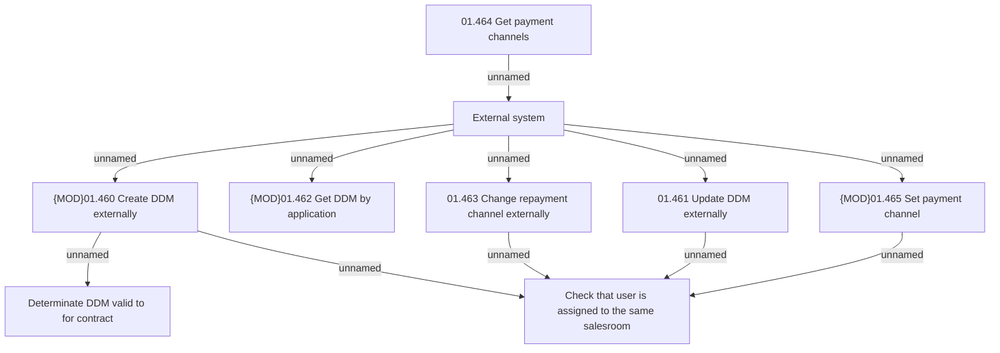

# Use Case

```mermaid
graph TD
    Check_that_user_is_assigned_to_the_same_salesroom["Check that user is assigned to the same salesroom"]
    MOD_01_465_Set_payment_channel["{MOD}01.465 Set payment channel"]
    n_01_464_Get_payment_channels["01.464 Get payment channels"]
    Determinate_DDM_valid_to_for_contract["Determinate DDM valid to for contract"]
    MOD_01_462_Get_DDM_by_application["{MOD}01.462 Get DDM by application"]
    n_01_461_Update_DDM_externally["01.461 Update DDM externally"]
    n_01_463_Change_repayment_channel_externally["01.463 Change repayment channel externally"]
    External_system["External system"]
    MOD_01_460_Create_DDM_externally["{MOD}01.460 Create DDM externally"]
    MOD_01_460_Create_DDM_externally -->|unnamed| Determinate_DDM_valid_to_for_contract
    MOD_01_460_Create_DDM_externally -->|unnamed| Check_that_user_is_assigned_to_the_same_salesroom
    External_system -->|unnamed| MOD_01_460_Create_DDM_externally
    External_system -->|unnamed| MOD_01_462_Get_DDM_by_application
    External_system -->|unnamed| n_01_463_Change_repayment_channel_externally
    External_system -->|unnamed| MOD_01_465_Set_payment_channel
    External_system -->|unnamed| n_01_461_Update_DDM_externally
    n_01_463_Change_repayment_channel_externally -->|unnamed| Check_that_user_is_assigned_to_the_same_salesroom
    n_01_461_Update_DDM_externally -->|unnamed| Check_that_user_is_assigned_to_the_same_salesroom
    n_01_464_Get_payment_channels -->|unnamed| External_system
    MOD_01_465_Set_payment_channel -->|unnamed| Check_that_user_is_assigned_to_the_same_salesroom
```
