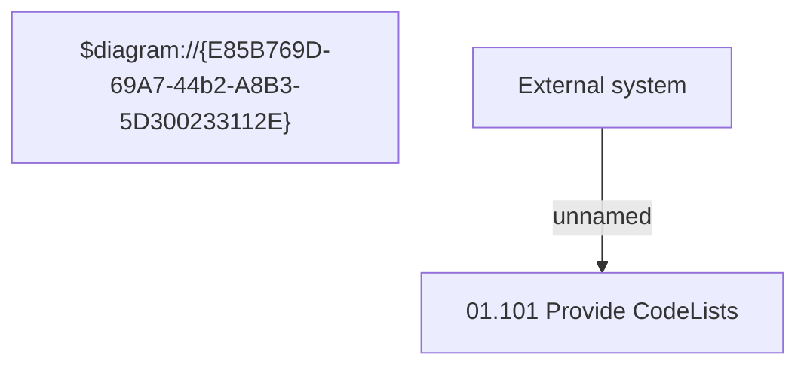

# Use Case

```mermaid
graph TD
    diagram_E85B769D_69A7_44b2_A8B3_5D300233112E["$diagram://{E85B769D-69A7-44b2-A8B3-5D300233112E}"]
    External_system["External system"]
    n_01_101_Provide_CodeLists["01.101 Provide CodeLists"]
    External_system -->|unnamed| n_01_101_Provide_CodeLists
```
