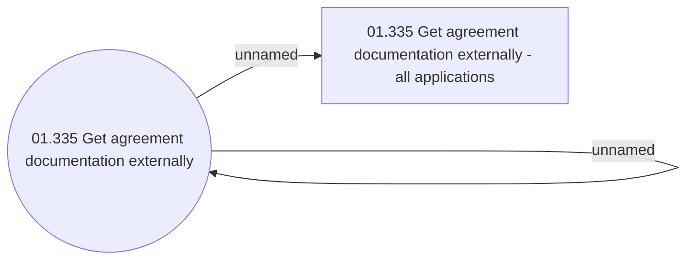

# Access Rights

- **Diagram Type**: Use Case
- **Package**: HomerSelect/BSL/Analysis Model/Contract Origination/Interface to external system (eshop)/Contract origination/Loan Agreement Management/Access Rights
- **Diagram ID**: 129804
- **Elements**: 3
- **Connectors**: 2

