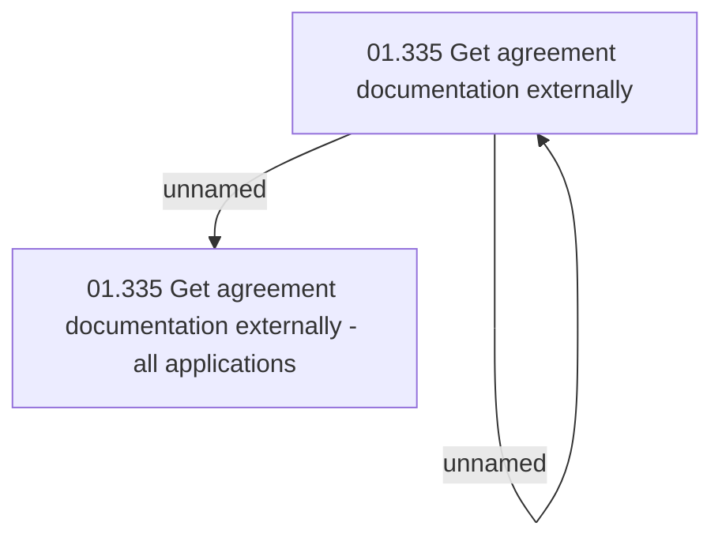

# Access Rights

```mermaid
graph TD
    n_01_335_Get_agreement_documentation_externally_all_applicat["01.335 Get agreement documentation externally - all applications"]
    n_01_335_Get_agreement_documentation_externally["01.335 Get agreement documentation externally"]
    n_01_335_Get_agreement_documentation_externally["01.335 Get agreement documentation externally"]
    n_01_335_Get_agreement_documentation_externally -->|unnamed| n_01_335_Get_agreement_documentation_externally
    n_01_335_Get_agreement_documentation_externally -->|unnamed| n_01_335_Get_agreement_documentation_externally_all_applicat
```
