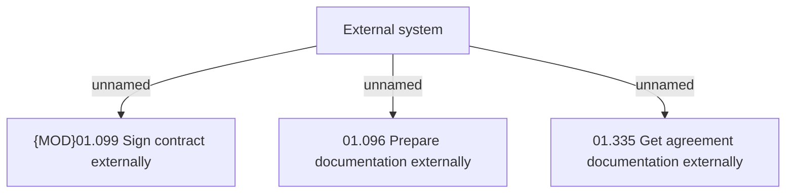

# Use Case

```mermaid
graph TD
    MOD_01_099_Sign_contract_externally["{MOD}01.099 Sign contract externally"]
    n_01_096_Prepare_documentation_externally["01.096 Prepare documentation externally"]
    External_system["External system"]
    n_01_335_Get_agreement_documentation_externally["01.335 Get agreement documentation externally"]
    External_system -->|unnamed| MOD_01_099_Sign_contract_externally
    External_system -->|unnamed| n_01_096_Prepare_documentation_externally
    External_system -->|unnamed| n_01_335_Get_agreement_documentation_externally
```
