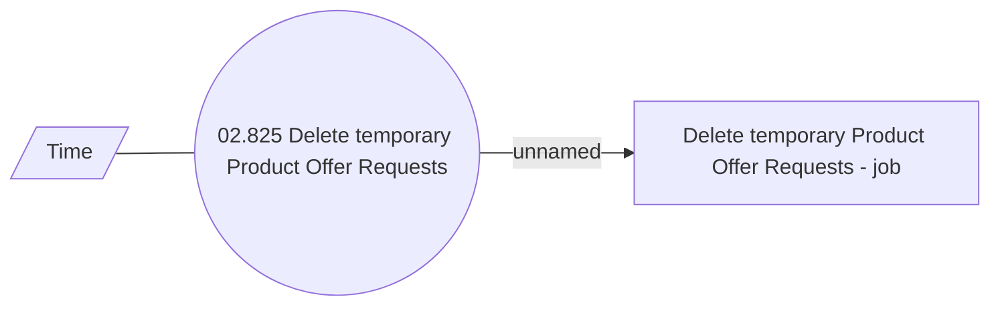

# Product Calculator for External system - Internal

- **Diagram Type**: Use Case
- **Package**: HomerSelect/BSL/Analysis Model/Contract Origination/Interface to external system (eshop)/Product Offer Calculation/Use Case
- **Diagram ID**: 158376
- **Elements**: 3
- **Connectors**: 2

