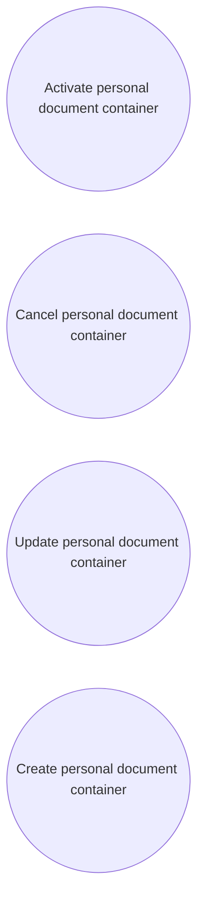

# Use Case Model

- **Diagram Type**: Use Case
- **Package**: HomerSelect/BSL/Analysis Model/Contract Origination/Loan origination configuration /Use Case Model/Personal Document Container
- **Diagram ID**: 118861
- **Elements**: 4
- **Connectors**: 0

