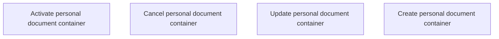

# Use Case Model

```mermaid
graph TD
    Activate_personal_document_container["Activate personal document container"]
    Cancel_personal_document_container["Cancel personal document container"]
    Update_personal_document_container["Update personal document container"]
    Create_personal_document_container["Create personal document container"]
```
