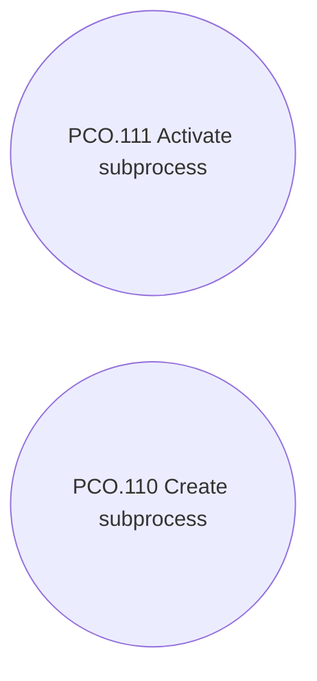

# Subprocess

- **Diagram Type**: Use Case
- **Package**: HomerSelect/BSL/Analysis Model/Contract Origination/Loan origination configuration /Use Case Model/Subprocess
- **Diagram ID**: 119100
- **Elements**: 2
- **Connectors**: 0

