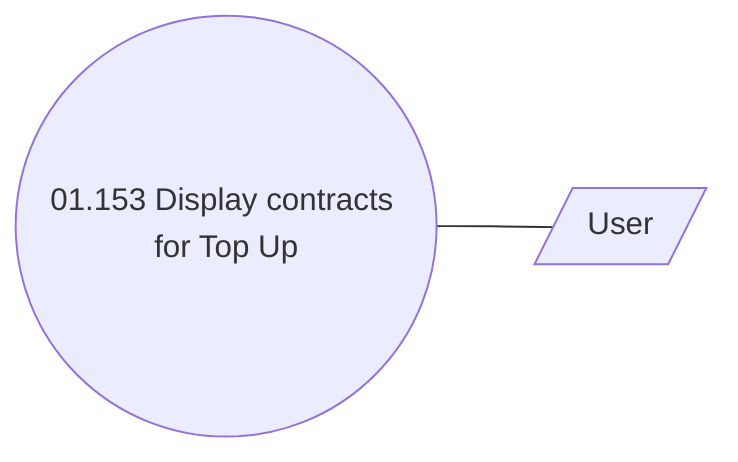

# Use Case Model

- **Diagram Type**: Use Case
- **Package**: HomerSelect/BSL/Analysis Model/Contract Origination/Manage Product Offer/Top up/Use Case Model
- **Diagram ID**: 158092
- **Elements**: 2
- **Connectors**: 1

