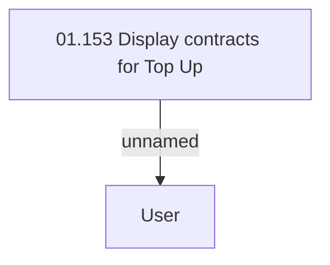

# Use Case Model

```mermaid
graph TD
    n_01_153_Display_contracts_for_Top_Up["01.153 Display contracts for Top Up"]
    User["User"]
    n_01_153_Display_contracts_for_Top_Up -->|unnamed| User
```
