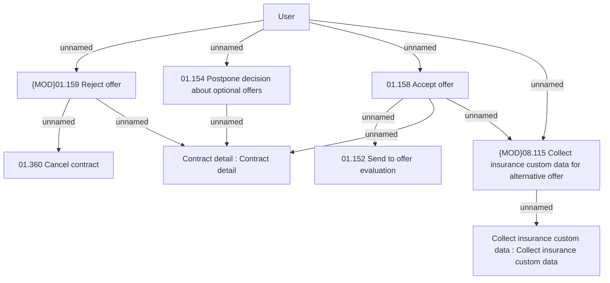

# Accept/Reject optional offers

```mermaid
graph TD
    Collect_insurance_custom_data_Collect_insurance_custom_data["Collect insurance custom data : Collect insurance custom data"]
    MOD_08_115_Collect_insurance_custom_data_for_alternative_off["{MOD}08.115 Collect insurance custom data for alternative offer"]
    n_01_154_Postpone_decision_about_optional_offers["01.154 Postpone decision about optional offers"]
    Contract_detail_Contract_detail["Contract detail : Contract detail"]
    MOD_01_159_Reject_offer["{MOD}01.159 Reject offer"]
    n_01_158_Accept_offer["01.158 Accept offer"]
    n_01_360_Cancel_contract["01.360 Cancel contract"]
    n_01_152_Send_to_offer_evaluation["01.152 Send to offer evaluation"]
    User["User"]
    n_01_158_Accept_offer -->|unnamed| n_01_152_Send_to_offer_evaluation
    MOD_01_159_Reject_offer -->|unnamed| n_01_360_Cancel_contract
    n_01_158_Accept_offer -->|unnamed| Contract_detail_Contract_detail
    n_01_154_Postpone_decision_about_optional_offers -->|unnamed| Contract_detail_Contract_detail
    MOD_01_159_Reject_offer -->|unnamed| Contract_detail_Contract_detail
    n_01_158_Accept_offer -->|unnamed| MOD_08_115_Collect_insurance_custom_data_for_alternative_off
    MOD_08_115_Collect_insurance_custom_data_for_alternative_off -->|unnamed| Collect_insurance_custom_data_Collect_insurance_custom_data
    User -->|unnamed| MOD_01_159_Reject_offer
    User -->|unnamed| n_01_154_Postpone_decision_about_optional_offers
    User -->|unnamed| n_01_158_Accept_offer
    User -->|unnamed| MOD_08_115_Collect_insurance_custom_data_for_alternative_off
```
