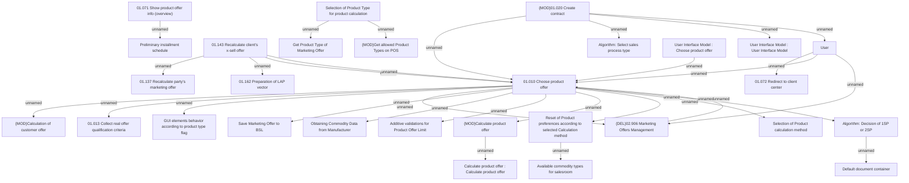

# Choose product offer

```mermaid
graph TD
    n_01_072_Redirect_to_client_center["01.072 Redirect to client center"]
    Preliminary_installment_schedule["Preliminary installment schedule"]
    n_01_071_Show_product_offer_info_overview["01.071 Show product offer info (overview)"]
    MOD_Calculation_of_customer_offer["{MOD}Calculation of customer offer"]
    n_01_013_Collect_real_offer_qualification_criteria["01.013 Collect real offer qualification criteria"]
    n_01_137_Recalculate_party_s_marketing_offer["01.137 Recalculate party's marketing offer"]
    Default_document_container["Default document container"]
    n_01_162_Preparation_of_LAP_vector["01.162 Preparation of LAP vector"]
    GUI_elements_behavior_according_to_product_type_flag["GUI elements behavior according to product type flag"]
    n_01_143_Recalculate_client_s_x_sell_offer["01.143 Recalculate client's x-sell offer"]
    DEL_02_906_Marketing_Offers_Management["{DEL}02.906 Marketing Offers Management"]
    Save_Marketing_Offer_to_BSL["Save Marketing Offer to BSL"]
    Get_Product_Type_of_Marketing_Offer["Get Product Type of Marketing Offer"]
    Obtaining_Commodity_Data_from_Manufacturer["Obtaining Commodity Data from Manufacturer"]
    MOD_Get_allowed_Product_Types_on_POS["{MOD}Get allowed Product Types on POS"]
    Selection_of_Product_Type_for_product_calculation["Selection of Product Type for product calculation"]
    Available_commodity_types_for_salesroom["Available commodity types for salesroom"]
    Calculate_product_offer_Calculate_product_offer["Calculate product offer : Calculate product offer"]
    MOD_Calculate_product_offer["{MOD}Calculate product offer"]
    Reset_of_Product_preferences_according_to_selected_Calculati["Reset of Product preferences according to selected Calculation method"]
    Selection_of_Product_calculation_method["Selection of Product calculation method"]
    n_01_010_Choose_product_offer["01.010 Choose product offer"]
    Algorithm_Select_sales_process_type["Algorithm: Select sales process type"]
    User_Interface_Model_User_Interface_Model["User Interface Model : User Interface Model"]
    User_Interface_Model_Choose_product_offer["User Interface Model : Choose product offer"]
    Algorithm_Decision_of_1SP_or_2SP["Algorithm: Decision of 1SP or 2SP"]
    User["User"]
    Additive_validations_for_Product_Offer_Limit["Additive validations for Product Offer Limit"]
    MOD_01_020_Create_contract["{MOD}01.020 Create contract"]
    n_01_071_Show_product_offer_info_overview -->|unnamed| Preliminary_installment_schedule
    n_01_010_Choose_product_offer -->|unnamed| MOD_Calculation_of_customer_offer
    n_01_010_Choose_product_offer -->|unnamed| n_01_013_Collect_real_offer_qualification_criteria
    n_01_143_Recalculate_client_s_x_sell_offer -->|unnamed| n_01_137_Recalculate_party_s_marketing_offer
    n_01_143_Recalculate_client_s_x_sell_offer -->|unnamed| n_01_162_Preparation_of_LAP_vector
    n_01_010_Choose_product_offer -->|unnamed| GUI_elements_behavior_according_to_product_type_flag
    n_01_010_Choose_product_offer -->|unnamed| DEL_02_906_Marketing_Offers_Management
    n_01_010_Choose_product_offer -->|unnamed| Save_Marketing_Offer_to_BSL
    Selection_of_Product_Type_for_product_calculation -->|unnamed| Get_Product_Type_of_Marketing_Offer
    n_01_010_Choose_product_offer -->|unnamed| Obtaining_Commodity_Data_from_Manufacturer
    Reset_of_Product_preferences_according_to_selected_Calculati -->|unnamed| Available_commodity_types_for_salesroom
    n_01_010_Choose_product_offer -->|unnamed| Additive_validations_for_Product_Offer_Limit
    n_01_010_Choose_product_offer -->|unnamed| MOD_Calculate_product_offer
    n_01_010_Choose_product_offer -->|unnamed| Reset_of_Product_preferences_according_to_selected_Calculati
    n_01_010_Choose_product_offer -->|unnamed| Selection_of_Product_calculation_method
    MOD_01_020_Create_contract -->|unnamed| n_01_010_Choose_product_offer
    n_01_143_Recalculate_client_s_x_sell_offer -->|unnamed| n_01_010_Choose_product_offer
    n_01_143_Recalculate_client_s_x_sell_offer -->|unnamed| n_01_010_Choose_product_offer
    User_Interface_Model_Choose_product_offer -->|unnamed| n_01_010_Choose_product_offer
    DEL_02_906_Marketing_Offers_Management -->|unnamed| n_01_010_Choose_product_offer
    MOD_01_020_Create_contract -->|unnamed| Algorithm_Select_sales_process_type
    MOD_01_020_Create_contract -->|unnamed| User_Interface_Model_User_Interface_Model
    n_01_010_Choose_product_offer -->|unnamed| Algorithm_Decision_of_1SP_or_2SP
    MOD_01_020_Create_contract -->|unnamed| User
    Selection_of_Product_Type_for_product_calculation -->|unnamed| MOD_Get_allowed_Product_Types_on_POS
    Algorithm_Decision_of_1SP_or_2SP -->|unnamed| Default_document_container
    User -->|unnamed| n_01_072_Redirect_to_client_center
    User -->|unnamed| n_01_010_Choose_product_offer
    User -->|unnamed| DEL_02_906_Marketing_Offers_Management
    MOD_Calculate_product_offer -->|unnamed| Calculate_product_offer_Calculate_product_offer
```
