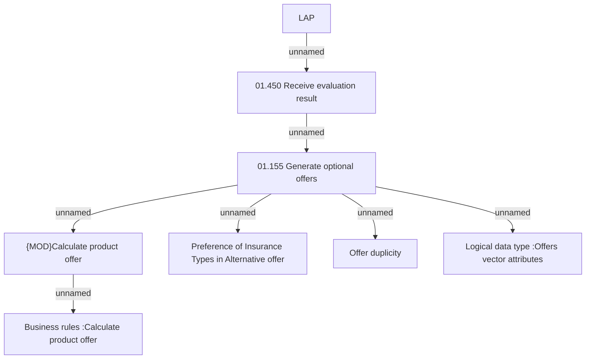

# Generate optional offers

```mermaid
graph TD
    MOD_Calculate_product_offer["{MOD}Calculate product offer"]
    Preference_of_Insurance_Types_in_Alternative_offer["Preference of Insurance Types in Alternative offer"]
    Offer_duplicity["Offer duplicity"]
    Logical_data_type_Offers_vector_attributes["Logical data type :Offers vector attributes"]
    n_01_155_Generate_optional_offers["01.155 Generate optional offers"]
    n_01_450_Receive_evaluation_result["01.450 Receive evaluation result"]
    LAP["LAP"]
    Business_rules_Calculate_product_offer["Business rules :Calculate product offer"]
    n_01_450_Receive_evaluation_result -->|unnamed| n_01_155_Generate_optional_offers
    n_01_155_Generate_optional_offers -->|unnamed| Logical_data_type_Offers_vector_attributes
    n_01_155_Generate_optional_offers -->|unnamed| Offer_duplicity
    n_01_155_Generate_optional_offers -->|unnamed| Preference_of_Insurance_Types_in_Alternative_offer
    n_01_155_Generate_optional_offers -->|unnamed| MOD_Calculate_product_offer
    LAP -->|unnamed| n_01_450_Receive_evaluation_result
    MOD_Calculate_product_offer -->|unnamed| Business_rules_Calculate_product_offer
```
