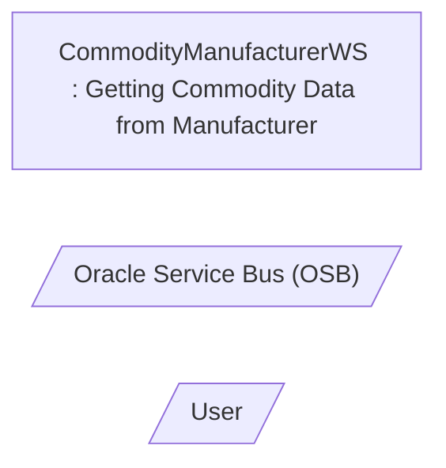

# Getting Commodity Data from Manufacturer

- **Diagram Type**: Use Case
- **Package**: HomerSelect/BSL/Analysis Model/Contract Origination/Manage Product Offer/UseCase Model
- **Diagram ID**: 159096
- **Elements**: 3
- **Connectors**: 0

