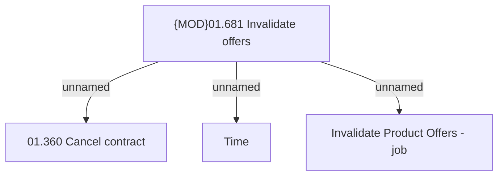

# Invalidate offers

```mermaid
graph TD
    Invalidate_Product_Offers_job["Invalidate Product Offers - job"]
    MOD_01_681_Invalidate_offers["{MOD}01.681 Invalidate offers"]
    Time["Time"]
    n_01_360_Cancel_contract["01.360 Cancel contract"]
    MOD_01_681_Invalidate_offers -->|unnamed| n_01_360_Cancel_contract
    MOD_01_681_Invalidate_offers -->|unnamed| Time
    MOD_01_681_Invalidate_offers -->|unnamed| Invalidate_Product_Offers_job
```
