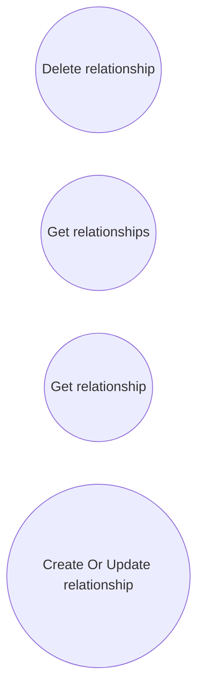

# Relationship

- **Diagram Type**: Use Case
- **Package**: HomerSelect/BSL/Analysis Model/Contract Origination/Party/Use Case Model
- **Diagram ID**: 133378
- **Elements**: 4
- **Connectors**: 0

```mermaid
graph LR
    Delete_relationship(("Delete relationship"))
    Get_relationships(("Get relationships"))
    Get_relationship(("Get relationship"))
    Create_Or_Update_relationship(("Create Or Update relationship "))
```
