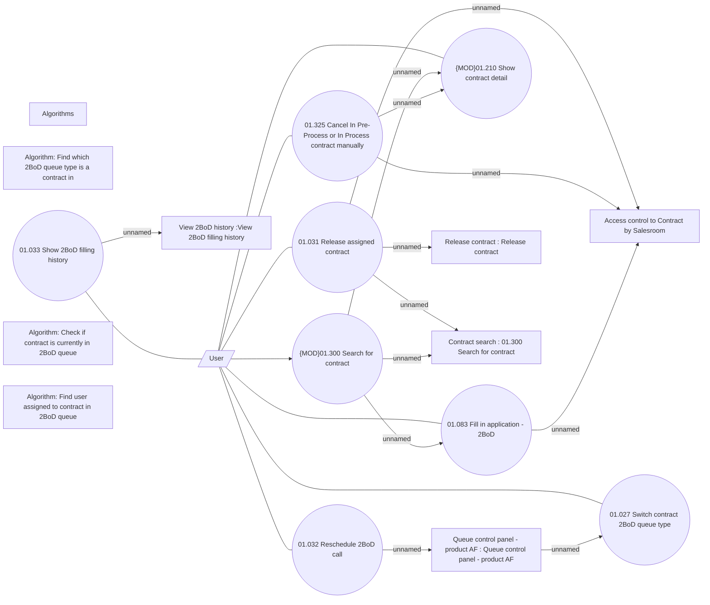

# 2BoD processing

- **Diagram Type**: Use Case
- **Package**: HomerSelect/BSL/Analysis Model/Contract Origination/Support for 2BoD Processing/UseCase Model
- **Diagram ID**: 149837
- **Elements**: 18
- **Connectors**: 20

