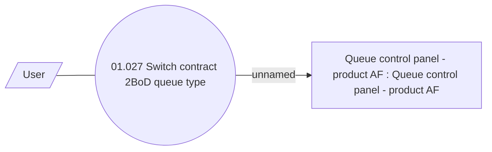

# Switch contract to front office

- **Diagram Type**: Use Case
- **Package**: HomerSelect/BSL/Analysis Model/Contract Origination/Support for 2BoD Processing/UseCase Model
- **Diagram ID**: 149836
- **Elements**: 3
- **Connectors**: 2

