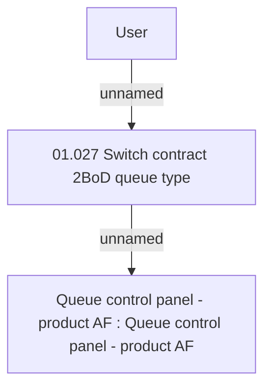

# Switch contract to front office

```mermaid
graph TD
    Queue_control_panel_product_AF_Queue_control_panel_product_A["Queue control panel - product AF : Queue control panel - product AF"]
    n_01_027_Switch_contract_2BoD_queue_type["01.027 Switch contract 2BoD queue type"]
    User["User"]
    User -->|unnamed| n_01_027_Switch_contract_2BoD_queue_type
    n_01_027_Switch_contract_2BoD_queue_type -->|unnamed| Queue_control_panel_product_AF_Queue_control_panel_product_A
```
