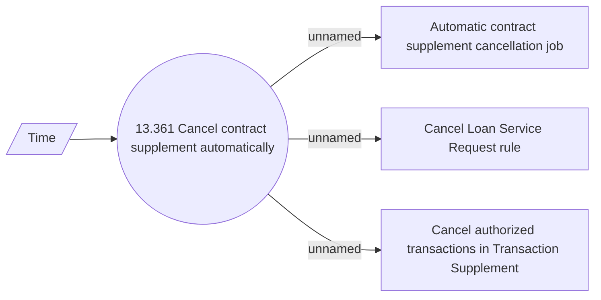

# Cancel contract supplement automatically

- **Diagram Type**: Use Case
- **Package**: HomerSelect/BSL/Analysis Model/Contract Supplements/COMMON for Supplements/Contract Supplement operations/Contract Supplement management/UseCase Model
- **Diagram ID**: 162792
- **Elements**: 5
- **Connectors**: 4

