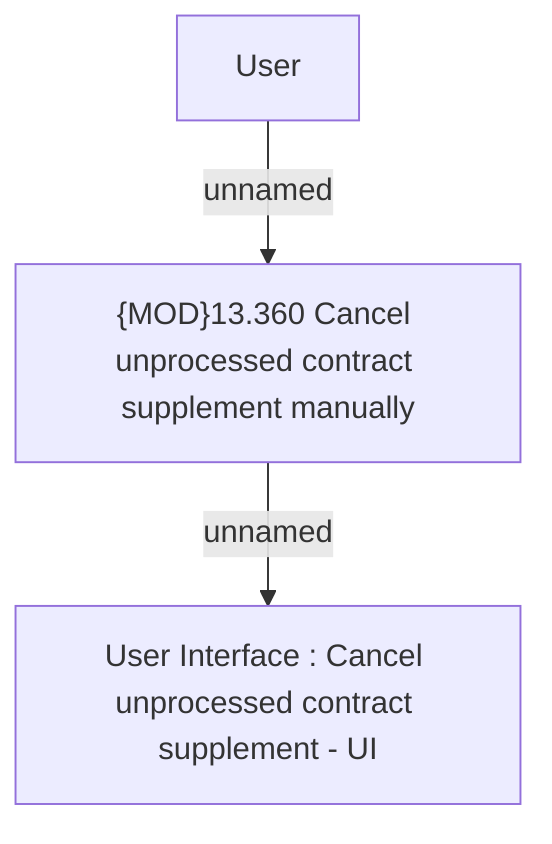

# Cancel contract supplement manually

```mermaid
graph TD
    User_Interface_Cancel_unprocessed_contract_supplement_UI["User Interface : Cancel unprocessed contract supplement - UI"]
    User["User"]
    MOD_13_360_Cancel_unprocessed_contract_supplement_manually["{MOD}13.360 Cancel unprocessed contract supplement manually"]
    MOD_13_360_Cancel_unprocessed_contract_supplement_manually -->|unnamed| User_Interface_Cancel_unprocessed_contract_supplement_UI
    User -->|unnamed| MOD_13_360_Cancel_unprocessed_contract_supplement_manually
```
