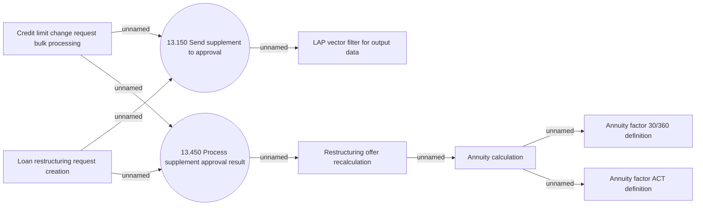

# Contract supplement approval

- **Diagram Type**: Use Case
- **Package**: HomerSelect/BSL/Analysis Model/Contract Supplements/COMMON for Supplements/Contract Supplement operations/Contract Supplement approval/Use Case Model
- **Diagram ID**: 163029
- **Elements**: 9
- **Connectors**: 9

